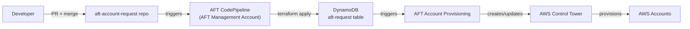
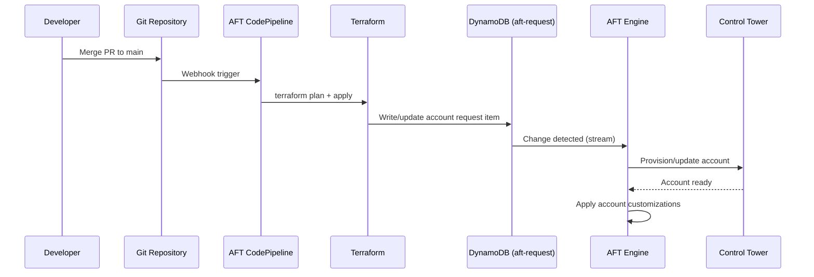
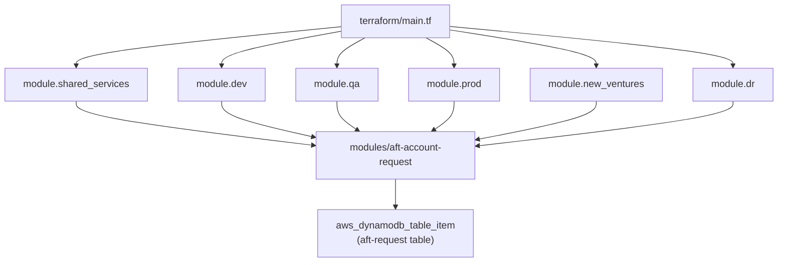
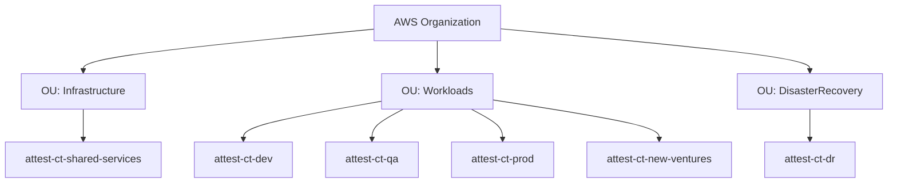

# Architecture -- aft-account-request

## Overview

This repository is one component of the AWS Account Factory for Terraform (AFT) system. It defines which AWS accounts should exist under AWS Control Tower. When changes are merged, the AFT pipeline reads the account requests from a DynamoDB table and provisions or updates accounts accordingly.

## System Context

## Data Flow

## Terraform Module Structure

## Account Topology

## Module Interface

The `aft-account-request` module accepts:

| Variable | Type | Required | Description |
|----------|------|----------|-------------|
| `control_tower_parameters` | object | Yes | AccountEmail, AccountName, ManagedOrganizationalUnit, SSO user details |
| `account_tags` | map(any) | Yes | Account-level tags (Name, ManagedBy) |
| `change_management_parameters` | object | Yes | Who requested the change and why |
| `custom_fields` | map(any) | No | Arbitrary metadata (group, description, account_alias) |
| `account_customizations_name` | string | No | Name of customizations to apply from AFT customizations repo |

The module writes a single DynamoDB item to the `aft-request` table, keyed by `AccountEmail`.

## Related AFT Repositories

<!-- TODO: human please fill in the actual repo URLs -->

| Repository | Purpose |
|------------|---------|
| `aft-account-request` (this repo) | Defines which accounts to provision |
| `aft-account-customizations` | Per-account Terraform customizations |
| `aft-global-customizations` | Customizations applied to all accounts |
| `aft-account-provisioning-customizations` | Pre/post provisioning hooks |

## Backend Configuration

Terraform state is stored remotely:
- **S3 bucket** with KMS encryption (configured via `backend.jinja`)
- **DynamoDB table** for state locking
- IAM role assumption via `aft_admin_role_arn`
- Backend config is auto-generated by AFT from `backend.jinja` -- never edit `backend.tf` directly.
